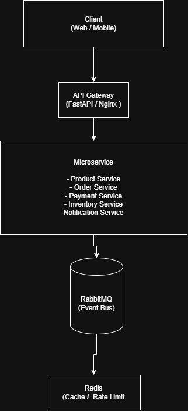

# Amazon-Style Distributed Marketplace (Microservices)

A **production-style distributed backend system** built with **FastAPI, Docker, RabbitMQ, Redis, and Microservices architecture**.

This project demonstrates how large-scale systems (like Amazon, Uber, or Flipkart) structure backend services using **event-driven communication, service isolation, and containerized infrastructure**.

---

# System Architecture



Client requests pass through an **API Gateway** which routes traffic to individual backend services.

Services communicate asynchronously using **RabbitMQ events**, enabling loose coupling and scalability.

**Redis** is used for caching and rate limiting to reduce latency and protect services.

---

# Tech Stack

Backend

* Python
* FastAPI

Infrastructure

* Docker
* Docker Compose

Messaging

* RabbitMQ (Event Bus)

Caching

* Redis

Architecture Patterns

* Microservices Architecture
* Event-Driven Architecture
* API Gateway Pattern

Testing

* Locust (Load Testing)

Documentation

* Swagger / OpenAPI

---

# Repository Structure

```
amazon-distributed-marketplace
│
├── docs
│   ├── architecture.drawio
│   ├── architecture.drawio.png
│   └── architecture.md
│
├── gateway
│   └── api-gateway
│       ├── app
│       └── Dockerfile
│
├── infrastructure
│   └── docker
│       └── docker-compose.yml
│
├── services
│   ├── product-service
│   ├── order-service
│   ├── payment-service
│   ├── inventory-service
│   └── notification-service
│
├── locustfile.py
├── system-design.md
├── README.md
└── .gitignore
```

---

# Services

### API Gateway

Routes external requests to internal services.

Responsibilities

* Request routing
* Central API entry point
* Swagger documentation

---

### Product Service

Handles product catalog operations.

Responsibilities

* Create product
* Fetch product list
* Product health monitoring

---

### Order Service

Responsible for order creation and publishing events.

Responsibilities

* Create order
* Publish order events to RabbitMQ

---

### Inventory Service

Consumes order events and updates inventory stock.

Responsibilities

* Consume order events
* Update stock availability

---

### Payment Service

Processes payment after order creation.

Responsibilities

* Handle payment processing
* Publish payment events

---

### Notification Service

Sends notifications when order flow completes.

Responsibilities

* Consume payment events
* Send confirmation notifications

---

# Event Flow

Order creation triggers a distributed event pipeline.

```
Client
  ↓
API Gateway
  ↓
Order Service
  ↓
RabbitMQ Event
  ↓
Inventory Service
  ↓
Payment Service
  ↓
Notification Service
```

This approach ensures services remain **loosely coupled and independently scalable**.

---

# Running the System Locally

Start all services using Docker.

```
docker compose up --build
```

---

# API Endpoints

### API Gateway

```
http://localhost:9000/docs
```

---

### Product Service

```
http://localhost:8001/docs
```

---

### Order Service

```
http://localhost:8002/docs
```

---

# RabbitMQ Dashboard

```
http://localhost:15672
```

Login

```
username: guest
password: guest
```

---

# Load Testing

This project includes **Locust** for performance testing.

Run:

```
locust -f locustfile.py
```

Then open:

```
http://localhost:8089
```

---

# Features

* Distributed Microservices Architecture
* Event-Driven Communication
* RabbitMQ Message Broker
* Redis Caching
* Dockerized Infrastructure
* API Gateway Pattern
* Swagger API Documentation
* Load Testing with Locust

---

# Future Improvements

* Distributed Rate Limiting
* Circuit Breaker Pattern
* Service Discovery
* Observability (Prometheus + Grafana)
* Kubernetes Deployment

---

# Deployment

The system can be deployed using **AWS EC2 with Docker Compose**.

Deployment allows public access to the API gateway:

```
http://<EC2_PUBLIC_IP>:9000/docs
```

---

# Learning Objectives

This project demonstrates key backend engineering concepts:

* Designing scalable microservices
* Event-driven system communication
* Containerized infrastructure
* API gateway routing
* Distributed system architecture

---

